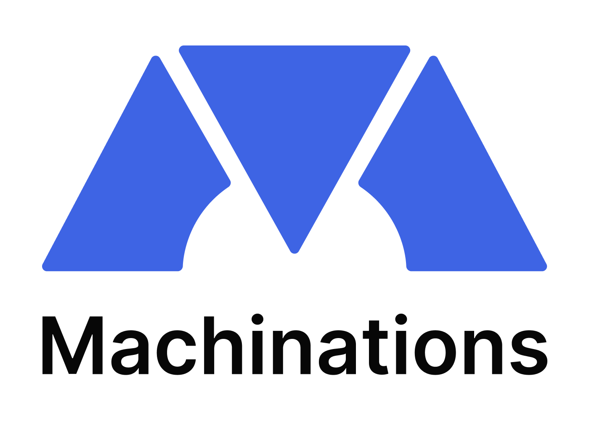

<h1 align="center">Atilla Duruel</h1>

-👋 Hi, I’m @atilladuruel.

-👀 I’m a Game Developer and Designer with a focus on creating immersive experiences.

-🌱 I specialize in Unity Game Engine and am always exploring new technologies and techniques.

-💞️ I’m looking to collaborate on innovative game projects and expand my skills.

-📫 You can reach me on LinkedIn.

  

<h3 align="center" >Programs</h3>

   
  
   
   
   

<h3 align="center" >Languages</h3>

   
  
   

<h3 align="center" >Contact Information</h3>

  
  

<!---
atilladuruel/atilladuruel is a ✨ special ✨ repository because its `README.md` (this file) appears on your GitHub profile.
You can click the Preview link to take a look at your changes.
--->
